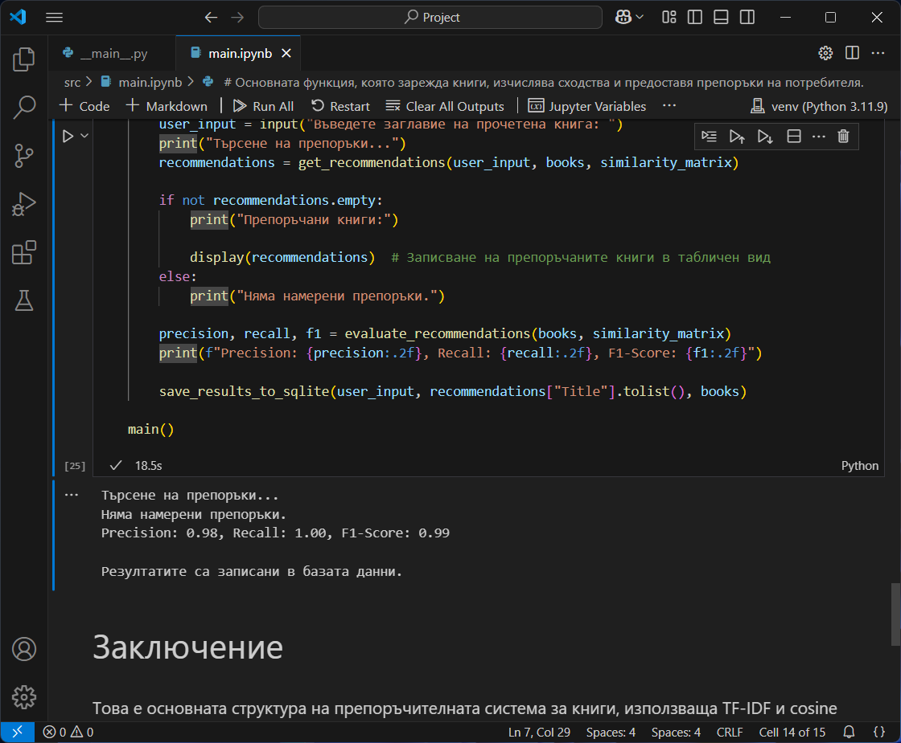

# Book Recommendation Generator 📚

A machine learning-based book recommendation system that suggests books based on user preferences.

## Features ✨
- **TF-IDF Vectorization** for analyzing book descriptions, authors, and genres.
- **Cosine Similarity** to determine book recommendations.
- **SQLite Database** for storing books and recommendation results.
- **JSON Dataset** containing book metadata.
- **Jupyter Notebook Support** for data analysis and model evaluation.
- **CLI-based Interface** for running recommendations through Python.

## Prerequisites 📜
Ensure you have the following installed:
- Python (3.x recommended)
- Virtual Environment (`venv`)
- SQLite

## Installation & Setup 🚀
Follow these steps to set up the project:

1. Clone the repository:
   ```sh
   git clone https://github.com/D1DY/DataMiningProject.git
   cd DataMiningProject
   ```

2. Create and activate a virtual environment:
   ```sh
   python -m venv venv
   venv\Scripts\activate  # On Windows
   source venv/bin/activate  # On macOS/Linux
   ```

3. Upgrade pip and install dependencies:
   ```sh
   python.exe -m pip install --upgrade pip
   pip install -r requirements.txt
   ```

4. Run the application:
   - As a python script:
     ```bash
     python -B -m src
     ```
   - As a Jupyter Notebook:
     ```bash
     jupyter notebook
     ```

## Dataset 📂
The dataset is stored in:
- `data.json`
-> SQLite database: `books_recommendations.db`

## Screenshots 🖼️
Example usage screenshots:




## Testing ✔️
- Use sample book titles and check the generated recommendations.
- Modify the dataset and observe changes in results.

## License 📜
This project is open-source and available under the MIT License.

---
Enjoy your personalized book recommendations! 📖✨

